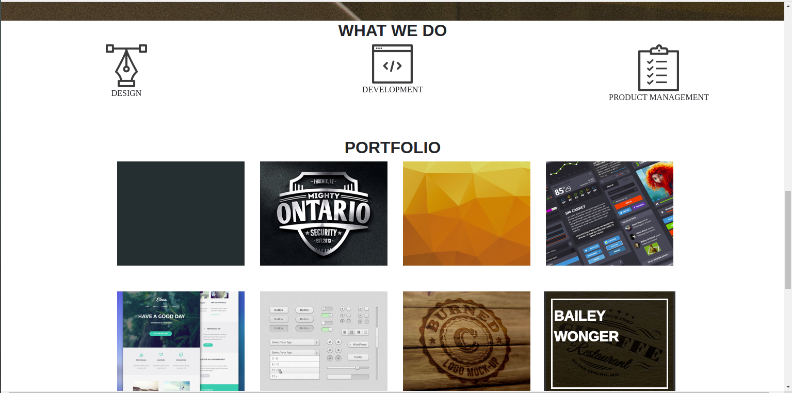

# Delani-Studio

## Author

[Antony Simiyu  Munyasia](https://github.com/Antony-me)

## Description
This is a project about Delani Studio, It shows the portfolio of Delani studio, the services offered and a form configured using mailChimp used 
## Screenshot



## How to run 

* Open terminal.

* Run   git clone ```https://github.com/Antony-me/delani-studio``` command.

* cd Delani-Studio - change directory.

* code . or atom . or a text editor of your choice.

## Technologies Used

* [HTML5](https://github.com/topics/html5)
* [CSS](https://github.com/topics/css3)
* [Bootstrap](https://github.com/topics/bootstrap)
* [jQuery](https://github.com/topics/javascript)


## BDD
| Behaviour      | Input        | Output       |
| :------------- | :----------: | -----------: |
|  Enter your name  |   Antony Simiyu  |  Name   |
| Enter a valid Email Address  | Email |  Email |
| Enter comment |  "Message"   |     |
| Submit|     |Alert " we have received your message. Thank you for reaching out to us.|

## Known Bugs
* mail chimp API has a few errors.

## Contact Information 

[antonymunyasia993@gmail.com]

# Live Page https://antony-me.github.io/delani-studio/

